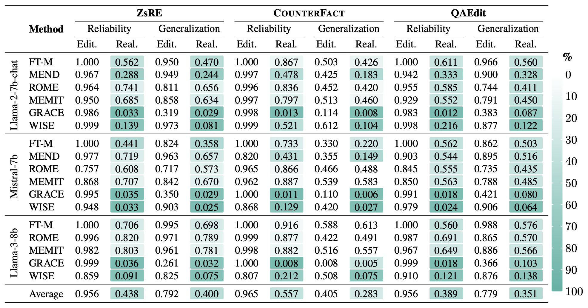

# Mirage of Model Editing

This repository hosts the code and data for the paper: **[The Mirage of Model Editing: Revisiting Evaluation in the Wild](https://arxiv.org/abs/2502.11177)**

### Table of Contents

- [Requirements](#requirements)
- [Editing](#editing)
- [Evaluations](#evaluations)
- [Metrics](#metrics)
- [Results](#results)
- [Citation](#citation)
- [Acknowledgment](#acknowledgment)

### Requirements:

- **Environment**: `requirements.txt` (Please use Python 3.9+ for this repository)

  ```shell
  pip install -r requirements.txt
  ```

- **Large Language Models to Edit**: 

  You have three options to load LLMs for editing:

  1. Download the LLMs you want to edit from [Hugging Face](https://huggingface.co/) and put them in `hugging_cache/` 

  2. Specify the path to your existing LLMs in the configuration files, e.g.,  `/hparams/FT/llama-7b.yaml`:

     ```yaml
     model_name: "your/path/to/LLMs"
     ```

  3. Provide the model name in the configuration files and the program will automatically employ `from_pretrained` to load the model:

     ```yaml
     model_name: "meta-llama/Llama-2-7b"
     ```

- **Datasets**: The data of **QAEdit**, [ZsRE](https://github.com/nicola-decao/KnowledgeEditor), and [COUNTERFACT](https://rome.baulab.info) are provided in [Google Drive](https://drive.google.com/drive/folders/1w9r7CL_a9k3HiorfSvE-RiShHvvrshoy?usp=drive_link). Execute `sh download_data.sh` will download the data and put them in `data/`:

  ```shell
  sh download_data.sh
  ```

- **Stats for ROME and MEMIT**: 

  You have three options to apply the ROME (R-ROME) and MEMIT editing algorithms:

  1. **Use Precomputed Stats Files** (Recommended for Best Results)

     (a) `download_stats.sh` will download the required stats files from [stats for llama2-7b](https://drive.google.com/drive/folders/1IGt7NNV-OxXqIljjr02_k0dDY50Z5N_E) (Provided by [EasyEdit](https://github.com/zjunlp/EasyEdit). And we will upload the stats files for llama3-8b and mistral-7b as soon as possible.) and put the `wikipedia_stats` directory into corresponding local directory `data/stats/{model_name}/wikipedia_stats`

     ```shell
     sh download_stats.sh
     ```

     (b) Set `mom2_adjustment` to `True` in corresponding configuration file, e.g., `/hparams/ROME/llama-7b.yaml`

     ```yaml
     mom2_adjustment: true
     ```

  2. **Calculate Stats Locally** (Time-Consuming)

     The program can also automatically calculate the stats required for them locally. However, the process is very time-consuming.

  3. **Quick Testing Without Stats Files** (Approximate Results)
  
     If you want to quickly test the effects without using stats files, you can skip downloading or calculating them. 
  
     Set `mom2_adjustment` to `false` in the corresponding configuration file, e.g., `/hparams/ROME/llama-7b.yaml` (which is also the default setting). 
  
     ```yaml
     mom2_adjustment: false
     ```
     
     This approach doesn't use stats files but can provide approximate editing effects.


### Editing:

#### Training-required Method MEND:

For training-required method MEND, you need to run `pretrain_mend.py` to train a hypernetwork/editor before editing. This will obtain a trained hypernetwork and store it in `./results/models/MEND/`

```shell
python pretrain_mend.py
```

#### Single & Sequential & Batch Editing

- If you want to perform single editing on **QAEdit**, you can execute `edit.py`

  ```shell
  python edit.py
  ```

- If you want to perform single editing on ZsRE and COUNTERFACT, you can refer to `edit_cf_zsre.py`

  ```shell
  python edit_cf_zsre.py
  ```

- You can set `sequential_edit=True` in these two files to perform sequential editing

  ```python
  metrics, edited_model, _ = editor.edit(
      # ......
      sequential_edit=True,
  )
  ```

- For batch editing, you can change `editor.edit` to `editor.batch_edit` and delete the `sequential_edit` field

  ```python
  metrics, edited_model, _ = editor.batch_edit(
      # ......
  )
  ```


### Evaluations:

We provide **tradition editing evaluation** and **real-world evaluation** of our paper in this repository.

You can specify the evaluation framework in the configuration files, e.g., `hparams/FT/llama-7b.yaml`.

The default configuration is:

```yaml
evaluation_framework: "real-world"     # "real-world" or "traditional"
# For real-world evaluation in our paper, you need to set
context_type:         "question-only"  # "qa_inst" for QA task instruction; "chat_temp" for chat model; default is question-only
metric_type:          "exact_match"    # "exact_match" or "llm_judge"
api_key:              "xxxxx"          # OpenAI API key for LLM judge (GPT-4o-mini)
```

The `exact_match` option primarily serves as an alternative for users who do not provide an OpenAI API key. Regardless of which metric calculation method is used, we will report the generated content for the corresponding fields of each sample. After editing is completed, you can extract these relevant fields and perform `llm_ judge` evaluations.

```txt
'post': {'rewrite_acc': 0.0, 'rewrite_gen_content': "Stone's Corner (now Unionville) 1 1 1831 1831 Stone's Corner (now Unionville) Original name of Forthton 204", 
'rephrase_acc': 0.0, 'rephrase_gen_content': "Stone's Corner Stone's Corner 1831 1831 12 10 100 "}
```


### Metrics

The program will automatically report the editing performance for each sample:

- `rewrite_acc`: *reliability* in editing/real-world evaluation
- `rephrase_acc`: *generalization* in editing/real-world evaluation
- `neighborhood_acc`: *locality* in editing/real-world evaluation


### Results

We present editing results under traditional editing evaluation (**Edit.**) and real-world evaluation (**Real.**) across various editing methods, LLMs, and datasets.



**We will continue to update and share more evaluation results for additional LLMs and editing methods!**


### Citation

If you have any further questions, please feel free to contact us. And if you find our work helpful, please cite our paper~

```bibtex

@misc{yang2025miragemodeleditingrevisiting,
      title={The Mirage of Model Editing: Revisiting Evaluation in the Wild}, 
      author={Wanli Yang and Fei Sun and Jiajun Tan and Xinyu Ma and Qi Cao and Dawei Yin and Huawei Shen and Xueqi Cheng},
      year={2025},
      eprint={2502.11177},
      archivePrefix={arXiv},
      primaryClass={cs.CL},
      url={https://arxiv.org/abs/2502.11177}, 
}

```


## Acknowledgment

Our code is based on [EasyEdit](https://github.com/zjunlp/EasyEdit) and [lm-evaluation-harness](https://github.com/EleutherAI/lm-evaluation-harness).