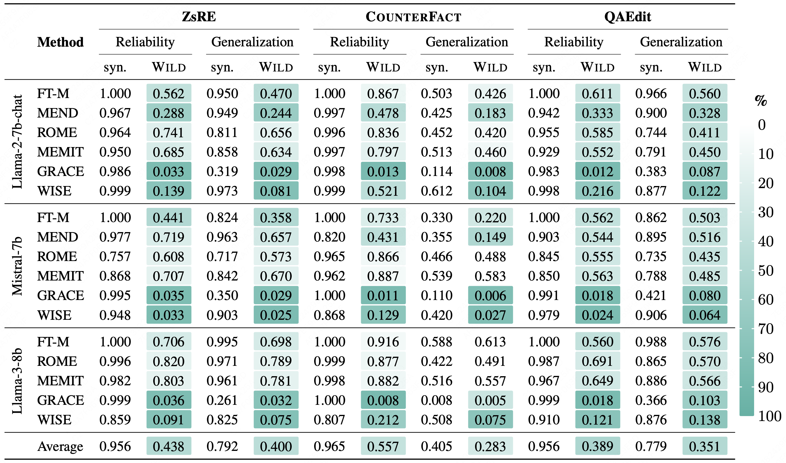

# Mirage of Model Editing

This repository hosts the code and data for the paper: **[The Mirage of Model Editing: Revisiting Evaluation in the Wild](https://arxiv.org/abs/2502.11177)**

### Table of Contents

- [📢News](#📢News)
- [Requirements](#requirements)
- [Editing](#editing)
- [Evaluations](#evaluations)
- [Metrics](#metrics)
- [Results](#results)
- [Citation](#citation)
- [Acknowledgment](#acknowledgment)


### 📢News

- 2025-06-02, we have released our QAEdit benchmark on [Hugging Face](https://huggingface.co/datasets/WenDingY/QAEdit).
- 2025-05-16, 🎉🎉 our paper ["The Mirage of Model Editing: Revisiting Evaluation in the Wild"](https://arxiv.org/abs/2502.11177) has been accepted to ACL 2025 Main Conference.
- 2025-03-04, our newly proposed **WILD evaluation framework** for model editing has been integrated into [EasyEdit](https://github.com/zjunlp/EasyEdit). You can also refer to it for a comprehensive evaluation of various editing techniques and datastes. Special thanks to the recognition and support of EasyEdit team.


### Requirements:

- **Environment**: `requirements.txt` (Please use Python 3.9+ for this repository)

  ```shell
  pip install -r requirements.txt
  ```

- **Large Language Models to Edit**: 

  You have three options to load LLMs for editing:

  1. Download the LLMs you want to edit from [Hugging Face](https://huggingface.co/) and put them in `./hugging_cache/` 

  2. Specify the path to your existing LLMs in the configuration files, e.g.,  `./hparams/FT/llama-7b.yaml`:

     ```yaml
     model_name: "your/path/to/LLMs"
     ```

  3. Provide the model name in the configuration files and the program will automatically employ `from_pretrained` to load the model:

     ```yaml
     model_name: "meta-llama/Llama-2-7b"
     ```

- **Datasets**: The data of **[QAEdit](https://huggingface.co/datasets/WenDingY/QAEdit)**, [ZsRE](https://github.com/nicola-decao/KnowledgeEditor), and [COUNTERFACT](https://rome.baulab.info) are provided in `./data/`

- **Stats for ROME and MEMIT**: 

  You have three options to apply the ROME (R-ROME) and MEMIT editing algorithms:

  1. **Use Precomputed Stats Files** (Recommended for Best Results)

     (a) `download_stats.sh` will download the required stats files from [stats for llama2-7b](https://drive.google.com/drive/folders/1IGt7NNV-OxXqIljjr02_k0dDY50Z5N_E) (Provided by [EasyEdit](https://github.com/zjunlp/EasyEdit). And we will upload the stats files for llama3-8b and mistral-7b as soon as possible.) and put the `wikipedia_stats` directory into corresponding local directory `./data/stats/{model_name}/wikipedia_stats`

     ```shell
     sh download_stats.sh
     ```

     (b) Set `mom2_adjustment` to `True` in corresponding configuration file, e.g., `./hparams/ROME/llama-7b.yaml`

     ```yaml
     mom2_adjustment: true
     ```

  2. **Calculate Stats Locally** (Time-Consuming)

     If you do not provide the required stats files but set `mom2_adjustment` to `True`, the program will automatically calculate the stats required for them locally. However, the process is very time-consuming.

  3. **Quick Testing Without Stats Files** (Approximate Results)
  
     If you want to quickly test the effects without using stats files, you can skip downloading or calculating them. 
  
     Set `mom2_adjustment` to `false` in the corresponding configuration file, e.g., `./hparams/ROME/llama-7b.yaml` (which is also the default setting). 
  
     ```yaml
     mom2_adjustment: false
     ```
     
     This approach doesn't use stats files but can provide approximate editing effects.


### Editing:

#### Training-required Method MEND:

For training-required method MEND, you need to run `pretrain_mend.py` to train a hypernetwork/editor before editing. This will obtain a trained hypernetwork and store it in `./results/models/MEND/`

```shell
python pretrain_mend.py
```

#### Single & Sequential & Batch Editing

- **Single Editing:** 

  ```shell
  python edit.py --editing_method FT --hparams_dir ./hparams/FT/llama-7b.yaml --data_path ./data/QAEdit.json --datatype qaedit --ds_size 100
  ```

- **Sequential Editing:** 

  ```shell
  python edit.py --editing_method FT --hparams_dir ./hparams/FT/llama-7b.yaml --data_path ./data/QAEdit.json --datatype qaedit --ds_size 100 --sequential_edit True
  ```
  (Note: the sequential editing refers to **sample-wise sequential editing** — editing one sample at a time continuously.)

- **Batch Editing:** 

  ```shell
  python edit.py --editing_method FT --hparams_dir ./hparams/FT/llama-7b.yaml --data_path ./data/QAEdit.json --datatype qaedit --ds_size 100 --batch_edit True
  ```
  (Note: the batch editing refers to **mini-batch setting** — continuously editing each batch of edits.)

  You can adjust the `batch_size` in corresponding configuration file, e.g., `./hparams/FT/llama-7b.yaml`

  ```yaml
  batch_size: 10
  ```


### Evaluations:

We provide **synthetic evaluation** and **WILD evaluation** of our paper in this repository.

For aforementioned commands, the default configurations are

```shell
python edit.py ... # --evaluation_type WILD --context_type question-only --api_key None
```

You can specify `evaluation_type`,  `context_type`, and `api_key` in the commands:

```markdown
--evaluation_type: `WILD` or `synthetic`
--context_type: default configuration is `question-only`; `qa_inst` for QA task instruction; `chat_temp` for chat model
--api_key: `xxx` (Your api_key for LLM-as-a-Judge (GPT-4o-mini). If you cannot provide an api_key, we will default to provide exact match as an alternative.)
```

We will report the **generated content** for the corresponding fields of each sample. After editing is completed, you can extract these relevant fields and then perform LLM-as-a-Judge evaluations.

```txt
'post': {'rewrite_acc': 0.0, 'rewrite_gen_content': "Stone's Corner (now Unionville) 1 1 1831 1831 Stone's Corner (now Unionville) Original name of Forthton 204", 
'rephrase_acc': 0.0, 'rephrase_gen_content': "Stone's Corner Stone's Corner 1831 1831 12 10 100 "}
```

(Note: `rewrite_acc` and `rephrase_acc` denote the *reliability* and *generalization* metrics, and `rewrite_gen_content` and `rephrase_gen_content` denote corresponding generated content for metric calculation.)


### Metrics

The program will automatically report the editing performance for each sample:

- `rewrite_acc`: *reliability* in synthetic/WILD evaluation
- `rephrase_acc`: *generalization* in synthetic/WILD evaluation
- `neighborhood_acc`: *locality* in synthetic/WILD evaluation


### Results

We present editing results under synthetic evaluation (**syn.**) and WILD evaluation (**WILD**) across various editing methods, LLMs, and datasets.



**We will continue to update and share more evaluation results of additional LLMs and editing methods!**


### Citation

If you have any further questions, please feel free to contact us. And if you find our work helpful, please cite our paper~

```bibtex

@misc{yang2025miragemodeleditingrevisiting,
      title={The Mirage of Model Editing: Revisiting Evaluation in the Wild}, 
      author={Wanli Yang and Fei Sun and Jiajun Tan and Xinyu Ma and Qi Cao and Dawei Yin and Huawei Shen and Xueqi Cheng},
      year={2025},
      eprint={2502.11177},
      archivePrefix={arXiv},
      primaryClass={cs.CL},
      url={https://arxiv.org/abs/2502.11177}, 
}

```


## Acknowledgment

Our code is based on [EasyEdit](https://github.com/zjunlp/EasyEdit) and [lm-evaluation-harness](https://github.com/EleutherAI/lm-evaluation-harness).
